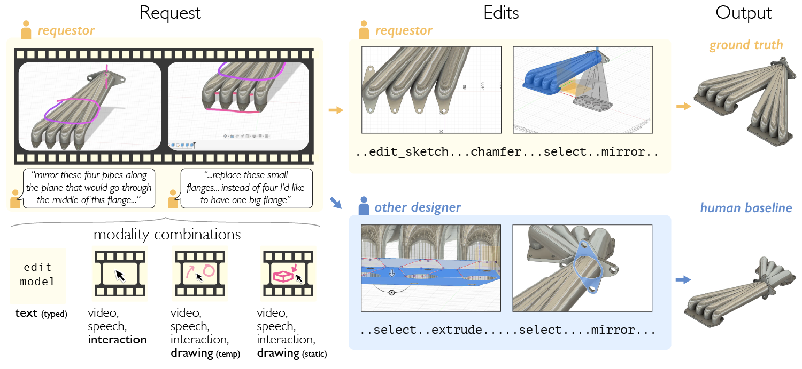
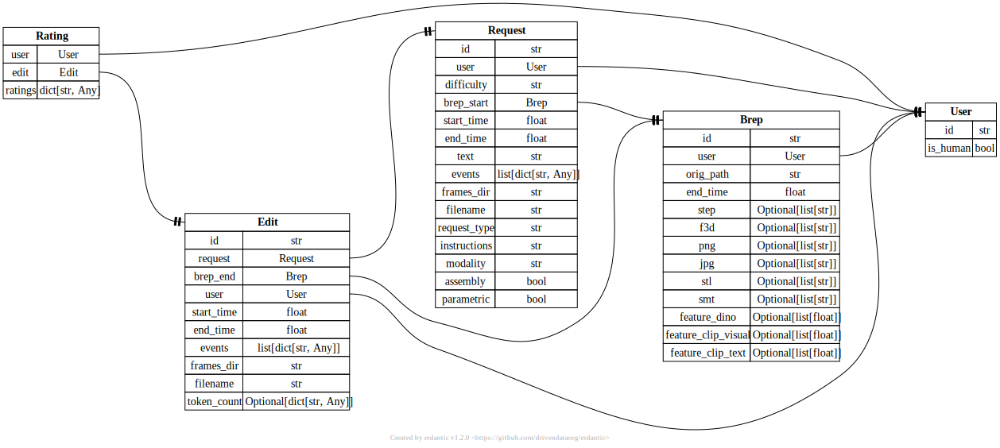

# neuralCAD-Edit

This repo contains the code for neuralCAD-Edit, a 3D CAD editing dataset and benchmark introduced in the paper: [neuralCAD-Edit: An Expert Benchmark for Multimodal-Instructed 3D CAD Model Editing](https://autodeskailab.github.io/neuralCAD-Edit/)




We provide:
- A dataset of 192 editing requests and 384 edits.
- Code for accessing the data.
- Notebooks for visualising and analysing the data.
- Harness code which allows foundation models to perform edits with iterative cadquery script refinement.
- All outputs of the foundation models we run in the paper and report results on.
- All automatic, human and VLM evaluations.

Instructions are provided below, but please get in touch if you would like help, or would like us to run a human eval process for you with the same workforce.

### Setup

1. Clone this repo
2. `conda env create -f environment.yml`

### Download and visualise data (recommended)

1. Download the pre-computed database to a desired local location. It's currently stored here: ```https://huggingface.co/datasets/autodesk/neuralCAD-Edit```
2. Set the `storage_dir` in the config to where the data has been saved.
3. You're good to go - try using `src/notebooks/visualise_examples.ipynb` to look at some of the data.

### Repo structure

- `src/config` - config jsons
- `src/harnesses` - contains the cadquery harness
- `src/notebooks` - notebook for visualising the database etc
- `src/scripts` - for running stages of the evaluation pipeline
- `src/scripts/benchmark_inference` - scripts to run a foundation model in a harness
- `src/scripts_grundtruth` - used to export/ingest for human labelling on AWS groundtruth
- `src/scripts_preprocess` - fusion plugin for preprocessing data/generating tasks
- `src/utils` - contains database, feature extraction, vlm rating etc.
- `src/vlms` - a base VLM class with provider specific files which inherit

### Running your own foundation model/harness

- You can either modify ours (see the cadquery harness in `src/vlms/base_vlm.py`, `src/harnesses/cadquery_script.py` and `src/scripts_benchmark_inference/run_harness.py` ). You can update model settings in the config, and an example of how to run is in `src/scripts/run_all.sh`
- Or you can write your own.
- Either way, you must produce a .step file and a settings.json with the appropriate data in. You can see what we do in `src/scripts_benchmark_inference/run_harness.py`
- You must also provide a single topright isometric view, and 6 orthographic views (top, bottom, front, back, left, right), and ensure they are in the correct file structure to be ingested. Additionally, some metrics require .stls. We provide two ways to export these in bulk from .steps if the harness does not natively output these files: `src/scripts_preprocess/fusion_convert` if you have Fusion, or `src/scripts_preprocess/cadquery_convert.py` if you'd rather do it headless.
- An single example model output ready to be ingested is in `example_data`. As long as your model output matches this file/folder structure, it will be OK.
- Add your output path to `models_dir` in the config.
- Ingest and run the evaluation in `src/scripts/run_all.sh`
- You can then use `src/notebooks/leaderboard.ipynb` to display the results.
- Note that these give you the automatic metrics only. We'll gladly run the human evals for you.

### Database Schema

The dataset/benchmark is organised in a local mongita database with the following schemas

- requests: contains all information about the request (video, transcription, etc).
- edits: contains all the information about an edit (screengrabs, fusion actions etc.)
- users: humans/ML models who have created requests, edits, or evaluations/rankings
- breps: contains all the information about a brep: .f3d .smt .stl, iso and 6-orthographic images, dino v2 features etc.
- ratings: ratings performed on an edit by a user

All objects (e.g. step files) live outside the database in the file tree, and are pointed to by their relative filepaths from the database. See `src/notebooks/visualise_examples.ipynb` for example access patterns.



### Citation

```bibtex
@inproceedings{perrett2026neuralcadedit,
  title={neuralCAD-Edit: An Expert Benchmark for Multimodal-Instructed 3D CAD Model Editing},
  author={Perrett, Toby and Bouchard, Matthew and McCarthy, William},
  booktitle={arXiv preprint arXiv:2604.16170},
  year={2026}
}
```